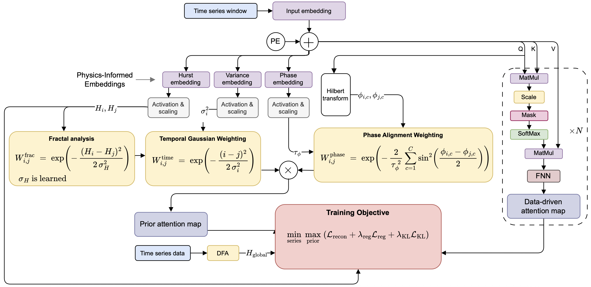
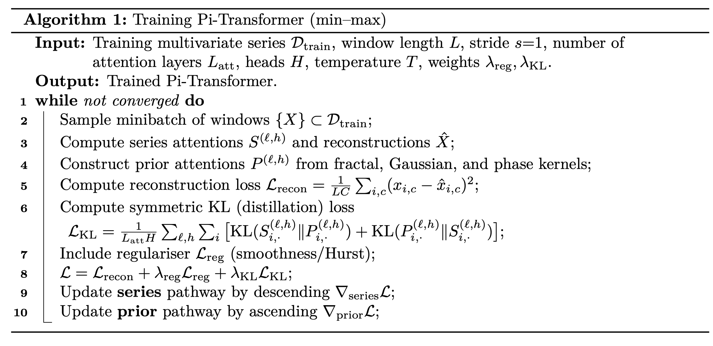
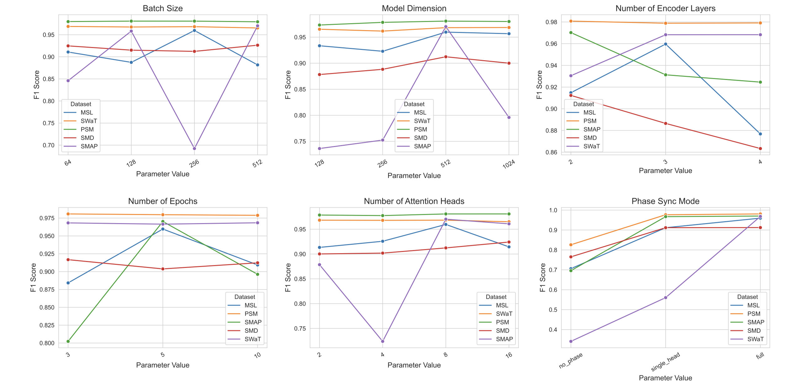

# Pi-Transformer
A physics-informed transformer for multivariate time-series anomaly detection.



## Overview
**Pi-Transformer** combines a data-driven *series attention* pathway with a smoothly evolving *prior attention* that encodes temporal invariants such as scale-related self‑similarity and phase synchrony. At inference, reconstruction evidence is modulated by **prior-alignment weights** to produce an **Energy** signal, complemented by a **mismatch** stream derived from the symmetric divergence between series and prior attentions. Robust normalisation and a soft‑OR fusion yield a single score that is thresholded globally. Stride‑1 overlapping windows are used for inference and evaluation.

Pi-Transformer is trained with a reconstruction objective plus regularisation that stabilises the prior while keeping it meaningfully distinct from the series pathway. A teacher–student alternation with stop‑gradient prevents collapse and preserves a measurable series–prior gap that is used at inference.

## Key ideas
- Dual-pathway attention: data-driven **series attention** + physics-informed **prior attention**.
- **Prior-alignment weights** from a time-wise softmax over the negatives of the series–prior divergence.
- **Energy** signal: alignment-weighted reconstruction evidence.
- **Mismatch** stream: aggregated symmetric divergence across layers and heads.
- **Fused score**: max of robustly normalised Energy and mismatch, with a single global threshold.
- Stride‑1 overlapping windows; point-adjust protocol for segment-level evaluation.

## Repository structure
```
.
├── config.yaml
├── data_loader.py
├── LICENSE
├── main.py
├── model/
│   ├── attn.py
│   ├── embed.py
│   └── PiTransformer.py
├── README.md
└── utils/
    ├── logger.py
    └── utils.py
```

## Getting started
> The repository includes `main.py`, a `config.yaml`, and a simple `data_loader.py`. Edit `config.yaml` with your dataset paths and hyperparameters, then run the training/evaluation script.

```bash
python main.py --dataset DATASET_NAME --mode train
python main.py --dataset DATASET_NAME --mode test
```

### Configuration
Typical keys you may specify in `config.yaml` (names may differ depending on your implementation):
- Dataset and paths: dataset name (e.g., SMD, MSL, SMAP, SWaT, PSM), data root, train/test split.
- Windowing: window length `L`, stride (typically 1).
- Model: number of attention layers, number of heads, model dimension.
- Inference: temperature `T` for sharpening the divergence aggregation.
- Regularisation: weights for smoothness and divergence terms.
- Optimisation: batch size, learning rate, max epochs, early stopping.
- Thresholding: percentile (via anomaly ratio) for the global fused-score threshold.

## How Pi-Transformer works
### Training
- Minimise reconstruction loss to model nominal dynamics.
- Apply a symmetric KL regulariser between series and prior attentions.
- Use a teacher–student alternation with stop‑gradient to encourage alignment without collapse.
- Smoothness constraints and light distillation stabilise the prior’s time-wise parameters.



### Inference
- Compute reconstruction error and the aggregated series–prior mismatch.
- Convert mismatch to prior-alignment weights via a time-wise softmax over its negatives.
- Form the Energy signal by reweighting reconstruction evidence with these alignment weights.
- Robustly normalise Energy and mismatch, fuse by a soft‑OR (max), and apply a single global percentile threshold.
- Use stride‑1 overlapping windows; evaluate with point-adjust for segment-level scoring.


## Results
Pi-Transformer achieves state-of-the-art or highly competitive F1 on five benchmarks (SMD, MSL, SMAP, SWaT, PSM), with particular strength on timing/phase-breaking anomalies.


Ablations highlight the importance of the physics-informed prior, the benefit of multi‑head priors for stability, and balanced depth/width.



## Reproducing benchmarks
- Standardise inputs per channel.
- Create overlapping windows of length `L` with stride 1.
- Train on nominal data/splits.
- During inference, compute reconstruction error, mismatch, prior-alignment weights, Energy, fused score, and apply a global percentile threshold.
- Report precision, recall, and F1 using the point-adjust protocol.

> See `data_loader.py`, `model/PiTransformer.py`, and `main.py` for implementation details.

<!-- ## Citation
If you find this work useful, please cite:
```bibtex
@article{PiTran,
  title={Pi-Transformer: A Physics-informed Attention Mechanism for Time Series Anomaly Detection},
  author={Maleki, Sepehr and Pourmoazemi, Negar},
  year={2025},
}
``` -->

## Acknowledgement
The data loader and early-stopping code are obtained from the [Anomaly Transformer](https://github.com/thuml/Anomaly-Transformer).
The datasets are pre-processed exactly as provided by the [Anomaly Transformer](https://github.com/thuml/Anomaly-Transformer).

## License
This project is distributed under the terms of the license found in the `LICENSE` file.
